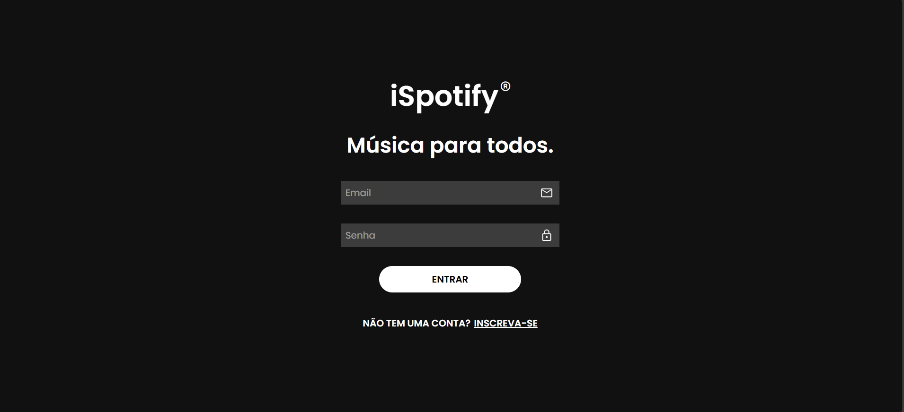
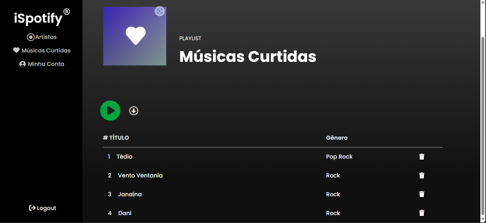
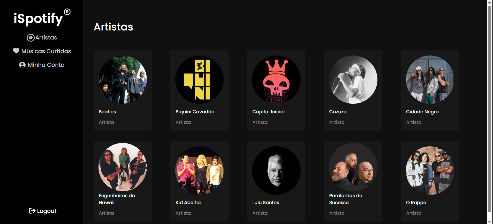
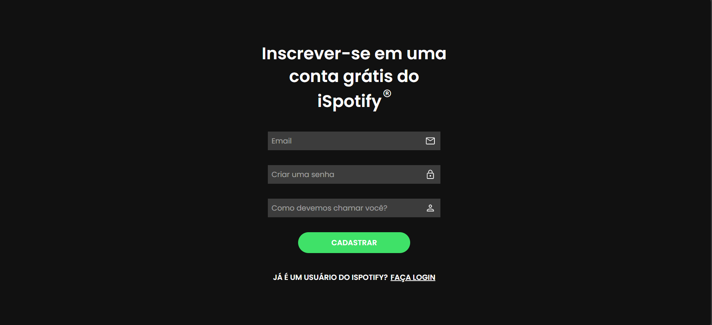

# iJunior-iSpotify

## Table of Contents

- [Overview](#overview)
  - [Screenshots](#screenshots)
  - [Links](#links)
  - [Built With](#built-with)


### Screenshot







### Links

- Solution URL: [https://trainee-spotify-test.vercel.app/](https://trainee-spotify-test.vercel.app/)

### Built With

- HTML
- Tailwind CSS
- Java Script
- React JS
- API from : [https://github.com/UFMGInformaticaJr/Trainee-Spotify-JS](https://github.com/UFMGInformaticaJr/Trainee-Spotify-JS)
- Vercel for deployment


<!-- ## Table of Contents
- How to run

### How to run
1. Clone this repo:
    ```bash
    git clone https://github.com/Riquelme3m/iJunior-Music-Player
    ```

2. Install api dependencies and start:
    ```bash
    cd trainee-spotify/api
    npm install
    npm start
    ```

3. Open another terminal, install front-end dependencies and start:
   ```bash
    cd trainee-spotify/front-end
    npm install
    npm run dev
    ```

    and access the url created.

    **Ready to use!**
<br></br>

For more info on the API, access: 
- https://github.com/UFMGInformaticaJr/Trainee-Spotify-JS -->